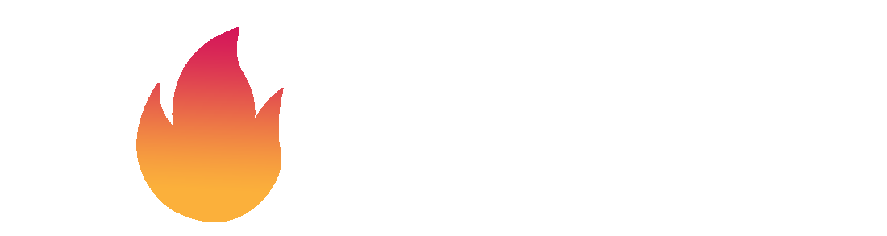

 

 
## Autor projektu: 
- **Ondřej Repko**

## Konzultanti
- [Štěpán Krautwurst](https://github.com/stallion7)
- [Tomáš Fryčka](https://github.com/kektoor)
- [Jakub Heisig](https://github.com/ncplyn)
- [Jan Slivka](https://github.com/HansS04)
- [Sofja Klopcová]()
 
 ## Hudební webová stránka s použitím Django 
Jakožto maturitní projekt jsem se rozhodl vytvořit web, přes který by si uživatel mohl importovat **vlastní MP3 soubory** a následně si hudbu přehrát. **Souborové ID3 Tagy by se přečetly a zobrazily na stránce** společně s funkcí přehrání a dalších několika podpůrných funkcí _(Tlačítka Forward/Backward, Randomizer..)_. Dále by se na webové stránce dokázal uživatel přihlásit skrz **Log-in systém**.

## Proč jsem si vybral tento projekt?
Tento projekt jsem si vybral, jelikož odjakživa miluji hudbu a tvorbu webových stránek. Také jsem se chtěl zdokonalit v pracování jak s jazykem _Python_, tak i s _Djangem_, což je tento projekt pro mě jako stvořený.

## Cíle
- [x] **Import MP3 souborů** a celých alb
- [x] **Přečtení ID3 Tagů a zobrazení** v responzivní podobě na stránce _(včetně grafiky)_
- [ ] Funkce **Fronta**, **Randomizer**, **Zobrazení textu**, **Vyhledání skladby na portálu Youtube** a **autora na Wikipedia**
- [x] **Simple Log-in a Register systém**
- [ ] **Určitá kustomizace stránky** _(Dark/White theme, Pozadí, Téma, UI..)_

## Použité Technologie
- **Django**
- **Python**
- **Docker Desktop**
- **HTML, CSS, Bootstrap 5.1**
- **Mutagen Python Library**
- **Různé JS a Python knihovny** _(pillow, widget-tweaks, fontawesome..)_

## Časový harmonogram a postup

#### Září
- 8.9 - Nalezení velice užitečných JS knihoven a funkcí, které v projektu využiji _(colour palletes, příjemně vypadající animace, gradient background efekty)_
- 16.9 - Studování a plánování backendu 
- 22.9 - Designování frontendu a vybírání správných barev/pozic

#### Říjen
- 4.10 - Při pushování commitu do repozitáře se mi projekt celý vymazal a 4.10.2022 jsem musel začít od začátku
- 12.10 - Testování aplikace, zdali vše správně funguje
- 14.10 - Studování Djanga a Pythonu
- 24.10 - Konzultace se spolužáky ohledně projektu
#### Listopad
- 6.11 - Oficiální start vytváření kódu _(vložení a linknutí modelů, aplikací)_
- 9.11 - Změna z Django CMS Quickstart na Django z důvodu neefektivnosti a uvědomění, že základní Django je lepší volba _(vytvořen nový repozitář)_
- 10.11 - Vložení modulů a vytvoření kódu pro autentifikaci uživatele
- 11.11 - Zhotovení navbaru
- 14.11 - Vytvoření CSS kódu pro pozadí Log-In stránky
- 15.11 - Log-In fórum
- 16.11 - Log-In dokončeno _(následuje reset hesla, guest account a front-end loginu)_
- 21.11 - Frontend indexu a loginu _(reset hesla nelze a guest account je zbytečný)_, uživatel se nyní může přihlásit a zobrazit si _base.html_
- 25.11 - Přepracování loginu, bugfixy a routing + vytvoření loga
- 29.11 - Přidání responzivního navbaru

#### Prosinec
- 1.12 - Zasazení html stránek do bloků, bugfixy, zlepšení registrace, začátek backendu, bootstrap 
- 5.12 - Zjednodušení navbaru, přidání footeru
- 6.12 - Bugfixy, přidání gradientu do navbar linků

# Zdroje
### Použité technologie a programy:
1. **Python** - https://www.python.org  
2. **PyCharm** - https://www.jetbrains.com/pycharm/
3. **Bootstrap** - https://getbootstrap.com/docs/5.1/getting-started/introduction/
4. **Docker Desktop** - https://www.docker.com/products/docker-desktop/
5. **Mutagen Python library** - https://mutagen.readthedocs.io/en/latest/user/id3.html
### Tutoriály, inspirace:
1. **Django Tutorial** - https://docs.djangoproject.com/en/4.1/intro/tutorial01/
2. **Django Reusable Apps** - https://docs.djangoproject.com/en/4.1/intro/reusable-apps/
3. **CSS Inspiration and Tutorials** - https://www.instagram.com/webdevlessons/
4. **Color Gradients** - https://www.instagram.com/p/Cg4M5pqvke5/
5. **W3Schools** - https://www.w3schools.com
6. **FontAwesome** - https://fontawesome.com/icons
7. **Basic Navbar Tutorial** - https://www.youtube.com/watch?v=qNifU_aQRio
8. **Footer Tutorials** - https://mdbootstrap.com/docs/standard/navigation/footer/
